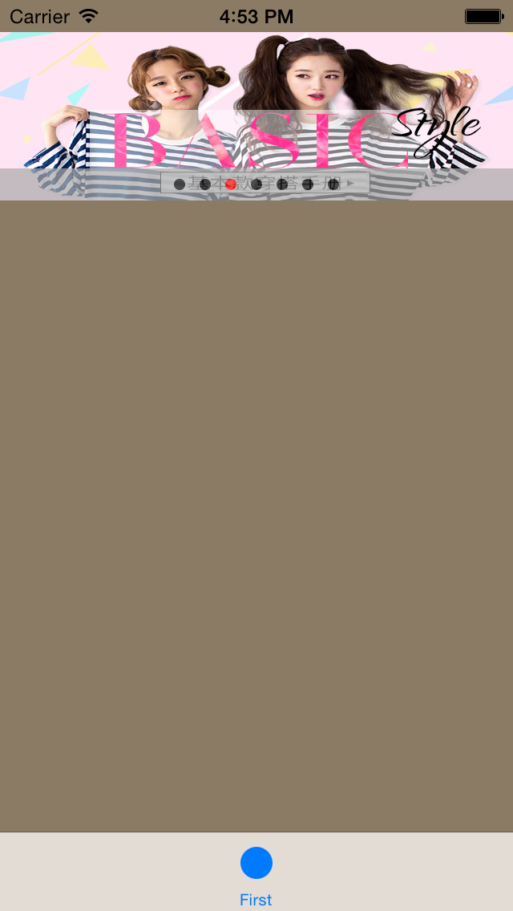

LoopScrollView
============


* Base on [SGFocusImageFrame](https://github.com/shanegao/SGFocusImageFrame) modify.

* more easy to use and understand.


## `LoopScrollView`



## Requirements

* Xcode 5
* iOS 5.0+
* ARC

##Usage
============

```

	int length = 7;
   
    NSMutableArray *itemArray = [[NSMutableArray alloc] init];
    
    SGFocusImageItem *item_last = [[SGFocusImageItem alloc] init];
    item_last.tag = -1;
    item_last.image = @"7.png";
    [itemArray addObject:item_last];
    
    for (int i = 1; i < length+1; i++)
    {
        SGFocusImageItem *item = [[SGFocusImageItem alloc] init];
        item.tag = i;
        item.image = [NSString stringWithFormat:@"%d.png",i];
        item.onCurrentItemPressed = ^(SGFocusImageItem *item){
            
            NSLog(@"item is =>%d",item.tag);
        };
        
        [itemArray addObject:item];
    }
 
    SGFocusImageItem *item_first = [[SGFocusImageItem alloc] init];
    item_last.tag = length;
    item_first.image = @"1.png";
    [itemArray addObject:item_first];
    
    SGFocusImageView *bannerView = [[SGFocusImageView alloc] initWithFrame:CGRectMake(0, 20, 320, 105) imageItems:itemArray isAuto:YES];
    bannerView.focusInterval = 4.0f;
    [bannerView scrollToIndex:0];
    [self.view addSubview:bannerView];

```
